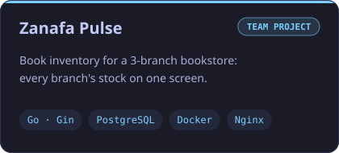
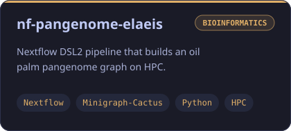
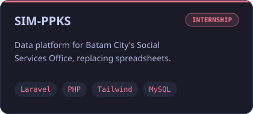
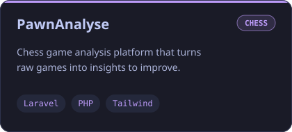
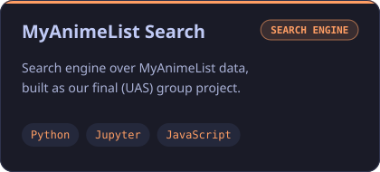

  
  
  
  
  

  

<h2 align="center">🧰 Tech stack</h2>

<table align="center">
  <tr>
    <td align="center"><b>Frontend</b></td>
    <td></td>
  </tr>
  <tr>
    <td align="center"><b>Backend</b></td>
    <td></td>
  </tr>
  <tr>
    <td align="center"><b>Data &amp; Bio</b></td>
    <td> </td>
  </tr>
  <tr>
    <td align="center"><b>Tools</b></td>
    <td></td>
  </tr>
</table>

<h2 align="center">🚀 Featured projects</h2>

  
  
  
  
  
  

<h2 align="center">📈 Activity</h2>

  
  

<picture>
  <source media="(prefers-color-scheme: dark)" srcset="https://raw.githubusercontent.com/DoniArmanS/DoniArmanS/output/github-snake-dark.svg" />
  
</picture>

